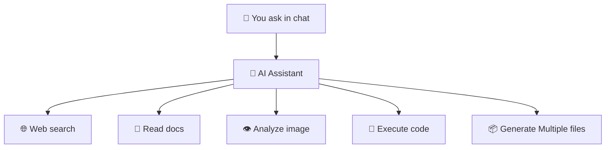

# KarnAGT - The AI Assistant That Actually Creates What You Need

**🌐 [Try KarnAGT Web App](https://karnagt.com/)**

- **[Technical System Overview](TECHNICAL_SYSTEM_OVERVIEW.md)** - Complete architecture and implementation details

---

A conversational AI Agent that researches the web, analyzes your images and files, runs code, and creates documents, visualizations, and reports—all through simple chat.

## Why It Matters

- **One simple interface for everyone** - No settings to configure, no models to choose
- **Automated intelligence** - The agent automatically selects the best approach for your task
- **Ask in any language, get exactly what you need in minutes** - From data analysis to document creation
- All the power of **coding, research, file QA and analysis**, accessible through 
simple conversation

## How It Works (Any language)

**You ask → It delivers:**

- *"Help me understand this research paper and summarize the key points"* → Reads PDF, creates clear summary
- *"Analyze my spending data and show me where my money goes"* → Creates charts and insights from your files
- *"Write a Python script to organize my photo collection"* → Generates working code with instructions
- *"Compare these job offers and help me decide"* → Reads documents, creates comparison table
- *"Create a study guide from these lecture notes"* → Processes files, creates formatted study materials

## What You Get From Simple Conversations

- **Clear explanations** with charts, graphs, and visual aids in multiple formats
- **Custom visualizations** — from simple charts to complex data analysis and interactive graphics
- **Useful files** — organized spreadsheets, formatted documents, working code
- **Current information** from web research with sources you can trust
- **Any kind of popular output formats** — Excel, CSV, HTML reports, PNG images, PDFs, JSON and more

## Where It Shines (What People Actually Ask For)

- **Students**: *"Help me understand this complex topic and create flashcards"* → Study materials with explanations
- **Researchers**: *"Analyze this dataset and find interesting patterns"* → Data insights with visualizations  
- **Developers**: *"Write code to solve this problem and explain how it works"* → Working scripts with documentation
- **Content Creators**: *"Turn this data into an engaging infographic"* → Visual content with clear design
- **Anyone**: *"Research this topic and create a simple summary I can share"* → Clear reports with sources

## What Makes It Powerful (Under the Hood)

- **Intelligent task routing** - automatically determines the best approach for your request
- **Always searches the web first** for current, accurate information
- **Reads 20+ file types** including PDFs, Excel, PowerPoint, images, CSVs
- **Runs real analysis** using Python with 100+ data science and visualization libraries  
- **Generates multiple file formats** — spreadsheets, documents, code, presentations, data files
- **Remembers your preferences** across conversations for consistent results

*For detailed technical capabilities, see [AI Agent Overview](AI_AGENT_OVERVIEW.md) and complete system architecture in [Technical System Overview](TECHNICAL_SYSTEM_OVERVIEW.md)*

## The Unified Agent Interface

**One Agent, All Capabilities:**

```text
You ask: "Compare this chart image with my reports and create outputs"
   ↓
Agent automatically searches web for latest info
   ↓  
Agent reads all your uploaded documents
   ↓
Agent analyzes chart image using vision
   ↓
Agent runs code to process everything
   ↓
Returns: Excel + HTML + PNG charts + PDF summary
```

**Zero Configuration Required:**
- No model selection needed - uses the best available automatically
- No parameter tuning - optimized settings applied internally
- No workflow setup - agent determines optimal approach for each task

**Detailed Flow:**



## Real Results Users Get

- **Ask once, get what you need** instead of spending hours learning new software
- **High-quality output** without technical expertise required
- **Current information** because it researches the web automatically
- **Personalized results** because it remembers your preferences and style

## Why Now

Most AI just gives you answers. This AI Agent actually creates what you need. Instead of "here's some information," you get "here's your completed document, code, or analysis ready to use."

## Get Started Today

**🚀 [Launch KarnAGT Web App](https://karnagt.com/)** - Start creating what you need through simple conversation.

## Learn More

- **[AI Agent Overview](AI_AGENT_OVERVIEW.md)** - Deep dive into capabilities and features
- **[Technical Overview (Mini)](TECHNICAL_SYSTEM_OVERVIEW_MINI.md)** - Concise technical summary
- **[Technical System Overview](TECHNICAL_SYSTEM_OVERVIEW.md)** - Complete technical architecture and implementation

---
